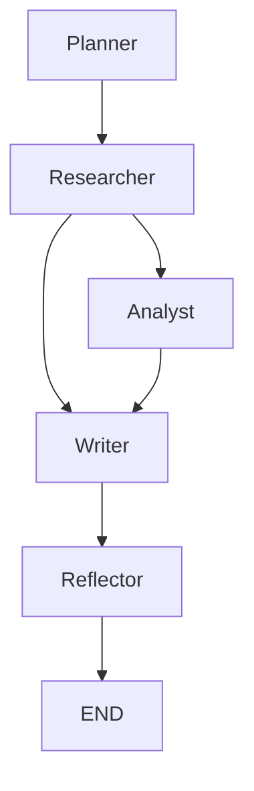

# Manus+ Super Agent (Minimal Demo)

- Intent detection
- Orchestration (planner → researcher → writer)
- Tiny in-memory RAG
- Safety checks
- Simple reflection
- FastAPI endpoints

## Quickstart

```bash
# python -m venv .venv && source .venv/bin/activate
pip install -r requirements.txt
uvicorn app.main:app --reload
# open http://127.0.0.1:8000/docs
```

### Demo call
POST `/chat` with JSON:
```json
{
  "user": {"user_id":"u1","name":"You","safety_tier":"normal"},
  "message": "请介绍一下这个超级智能体的能力，并给出实现建议"
}
```


## Extended Endpoints

- `POST /ingest/text` — 索引一段文本到 RAG  
  form fields: `text`, `source`

- `POST /ingest/image` — 上传图片（演示版 OCR，占位作索引）

- `POST /ingest/audio` — 上传音频（演示版 ASR，占位作索引）

- `POST /analyze/csv` — 上传 CSV 返回基础统计，并把摘要写入向量库

- `POST /tool/exec` — 安全数学表达式求值（仅允许 `math.*` 与常见运算），示例：
  ```bash
  curl -X POST -F 'expr=sin(pi/2)+sqrt(9)' http://127.0.0.1:8000/tool/exec
  ```


## LangGraph + OpenAI 版本

- 使用 LangGraph 作为多智能体编排 DAG
- 模型路由选择小模型 (gpt-4o-mini) 或大模型 (gpt-4.1) 或多模态 (gpt-4o)
- 需要设置环境变量：

```bash
export OPENAI_API_KEY="sk-xxxx"
```


## Orchestrator DAG (LangGraph)

下面是多智能体编排的有向图：




## Execution Trace Logging

每次调用 `/chat`，系统都会在 `runs/trace_*.json` 中记录轨迹，包含：
- 节点名 (planner / researcher / writer / reflect …)
- 输入消息
- 输出结果
- 命中引用 (citations)
- 安全策略 flags

示例：

```json
[
  {
    "node": "planner",
    "messages_in": [{"role":"user","content":"介绍一下超级智能体"}],
    "outcome_before": null,
    "outcome_after": null,
    "safety_flags": [],
    "citations": []
  },
  ...
]
```


## Trace Visualization

你可以使用工具 `tools/trace_viz.py` 将 JSON 轨迹转为 Markdown 表格或 Mermaid 序列图：

```bash
python tools/trace_viz.py runs/trace_20250918_203000.json --fmt md
python tools/trace_viz.py runs/trace_20250918_203000.json --fmt mermaid
```
